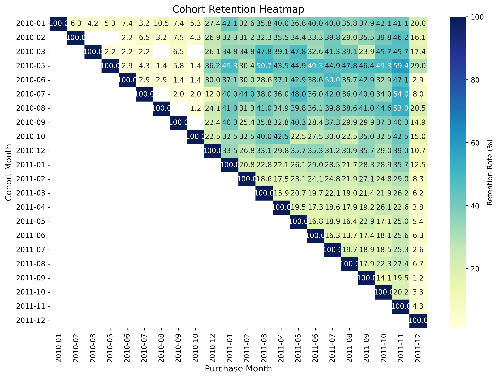
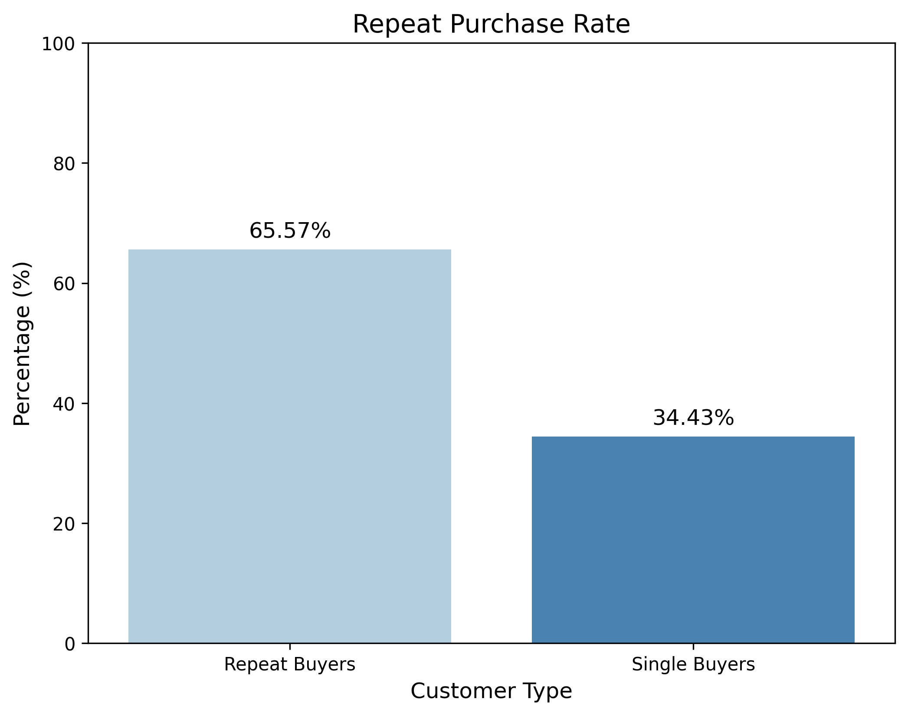
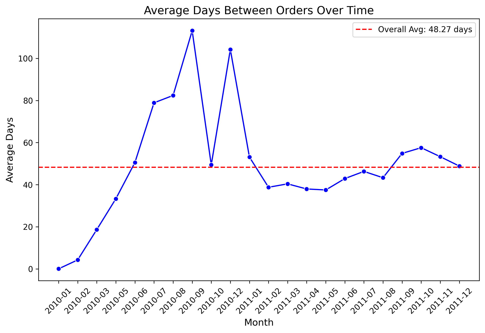

# Customer Retention Analysis for Indian E-Commerce Platform

A SQL-based analysis of customer retention using the [Online Retail II UCI dataset](https://www.kaggle.com/datasets/mashlyn/online-retail-ii-uci). This project explores repeat purchase rates, cohort retention, and order frequency to provide actionable insights for improving customer loyalty in an Indian e-commerce context, such as platforms like Flipkart or Amazon. Completed on June 10, 2025.

## Table of Contents
- [Project Overview](#project-overview)
- [Data Cleaning](#data-cleaning)
- [Analysis Steps](#analysis-steps)
- [Visualizations](#visualizations)
- [Conclusion](#conclusion)
- [How to Run the Project](#how-to-run-the-project)
- [Future Improvements](#future-improvements)

## Project Overview
This project analyzes customer behavior to enhance retention strategies for an e-commerce platform. Using SQL, I examined:
- **Repeat Purchase Rate**: Percentage of customers with multiple purchases.
- **Cohort Retention**: Retention rates by first-purchase month.
- **Average Time Between Orders**: Frequency of customer purchases.

The analysis provides business recommendations like loyalty programs and re-engagement campaigns, tailored to Indian e-commerce platforms.

## Data Cleaning
To prepare the dataset for analysis:
- Removed rows with null `CustomerID` and negative `Quantity` (e.g., returns).
- Deduplicated transactions using `DISTINCT` on `CustomerID`, `InvoiceNo`, and `InvoiceDate`.
- Created a clean table (`online_retail_transactions`) with ~18,566 transactions.

**Query File**: [data_cleaning.sql](sql/data_cleaning.sql)

**Insights**: Data quality issues (e.g., missing `CustomerID`) were resolved, ensuring reliable metrics.

## Analysis Steps

### Repeat Purchase Rate
- **Purpose**: Identify the percentage of customers with multiple purchases.
- **SQL Techniques**: CTEs, `COUNT(DISTINCT)`, `CASE`, `ROUND`.
- **Results**: 65.57% repeat purchase rate.
- **Insights**: Strong loyalty exists, but 34.43% of customers make only one purchase, indicating an opportunity for re-engagement.
- **Query File**: [repeat_purchase_rate.sql](sql/repeat_purchase_rate.sql)

### Cohort Retention Analysis
- **Purpose**: Track retention by first-purchase month.
- **SQL Techniques**: CTEs, `TO_CHAR`, `LEFT JOIN`, `COUNT(DISTINCT)`.
- **Results**: Retention peaks at 59.4% for the 2010-05 cohort in 2011-11.
- **Insights**: Retention varies, with early cohorts showing lower loyalty, suggesting a need for early engagement strategies.
- **Query File**: [cohort_retention.sql](sql/cohort_retention.sql)

### Average Time Between Orders
- **Purpose**: Measure purchase frequency.
- **SQL Techniques**: `LAG`, `EXTRACT`, `AVG`.
- **Results**: Average of 48.27 days between orders.
- **Insights**: Moderate frequency suggests room for improvement through time-sensitive promotions.
- **Query File**: [avg_time_between_orders.sql](sql/avg_time_between_orders.sql)

## Visualizations
- **Repeat Purchase Rate**: Bar chart showing 65.57% repeat vs. 34.43% single buyers.  
  
- **Cohort Retention**: Heatmap visualizing retention rates across cohorts.  
  
- **Order Frequency**: Line graph showing average days between orders over time.  
  

The visualizations were generated using Python (`pandas`, `matplotlib`, `seaborn`) with data from `cohort_table.csv` and `monthly_order_gaps.csv`, available in the root directory.

## Conclusion
**Key Findings**:
- **65.57%** repeat purchase rate, with 34.43% single-purchase customers.
- **59.4%** peak cohort retention (2010-05 cohort, 2011-11).
- **48.27 days** average order interval.

**Recommendations**:
- Implement loyalty programs (e.g., reward points for repeat purchases).
- Launch re-engagement campaigns targeting single-purchase customers (e.g., email reminders, discounts).
- Offer time-sensitive promotions or subscriptions to reduce the 48.27-day order interval.

## How to Run the Project
1. Download the [Online Retail II UCI dataset](https://www.kaggle.com/datasets/mashlyn/online-retail-ii-uci).
2. Load the CSV into pgAdmin or SQLite using [DB Browser for SQLite](https://sqlitebrowser.org/).
3. Run SQL scripts in order:
   - [data_cleaning.sql](sql/data_cleaning.sql)
   - [repeat_purchase_rate.sql](sql/repeat_purchase_rate.sql)
   - [cohort_retention.sql](sql/cohort_retention.sql)
   - [avg_time_between_orders.sql](sql/avg_time_between_orders.sql)
4. Export the results of `cohort_retention.sql` as `cohort_table.csv` and `avg_time_between_orders.sql` as `monthly_order_gaps.csv`.
5. Use a Python script with `pandas`, `matplotlib`, and `seaborn` to generate the visualizations (refer to the `visualizations` folder for the output PNGs).

## Future Improvements
- Add product category analysis to identify high-retention items.
- Use Python or Power BI for advanced, interactive visualizations.
- Analyze seasonal trends to refine marketing strategies for Indian festivals like Diwali.
